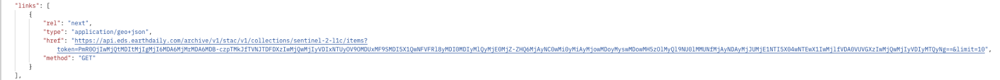

# STAC Endpoints

The base URL of the STAC catalog is https://api.earthdaily.com/platform/v1/stac and below are various endpoints

* [Collections](#collections)
* [Collection](#collection) 
* [Items](#items)
* [Item](#item)
* [Queryables](#queryables)
* [Search](#search)
    * [Basic Search via GET Method](#basic-search-via-get-method)
    * [Basic Search via POST Method](#basic-search-via-post-method)
    * [Query Extension via POST Method](#query-extension-via-post-method)
    * [Fields Extension](#fields-extension)
    * [Sortby Extension](#sortby-extension)
* [Downloading Assets](#downloading-assets)
* [Cloud Mask Query](#cloud-mask-query)

## Collections 
Return list of all Collections
```
GET https://api.earthdaily.com/platform/v1/stac/collections
```
**Example** : [Command Line](CommandLine.md#collections) | [Postman](Postman.md#collections) | [Python](Python.md#get-collections)

## Collection 
Return specific Collection

```
GET https://api.earthdaily.com/platform/v1/stac/collections/<COLLECTION_ID>
```

This end point takes the collection id as parameter. Below are some examples

| Collection | URL |  
|------------------------------|--------------------------------------------------------------------|
| Sentinel-2 L1C | https://api.earthdaily.com/platform/v1/stac/collections/sentinel-2-l1c |
| Landsat Collection 2 L1 | https://api.earthdaily.com/platform/v1/stac/collections/landsat-c2l1 |
| Venus L2A | https://api.earthdaily.com/platform/v1/stac/collections/venus-l2a |

```
Response of the above requests is metadat about the collection
```
**Example** : [Command Line](CommandLine.md#collection) | [Postman](Postman.md#collection) | [Python](Python.md#get-a-specific-collection)


## Items 
Return paged Items ordered by datetime descending (It doesn’t support search parameters, so often /stac/v1/search is preferred instead)
```
GET https://api.earthdaily.com/platform/v1/stac/collections/<COLLECTION_ID>/items
```

This end point takes the collection id as parameter. Below are some examples

|  Collection |  URL | 
|----------------------|-------------------|
| Sentinel-2 | https://api.earthdaily.com/platform/v1/stac/collections/sentinel-2-l1c/items |
| Landsat Collection 2 L1 | https://api.earthdaily.com/platform/v1/stac/collections/landsat-c2l1/items |
| Venus L2A | https://api.earthdaily.com/platform/v1/stac/collections/venus-l2a/items |


The response also contains a link to the next set of items 


<!--Space for examples -->
**Example** : [Command Line](CommandLine.md#items) | [Postman](Postman.md#items) 


## Item 
Returns a single Item for a given Collection and Item ID
```
GET https://api.earthdaily.com/platform/v1/stac/collections/<COLLECTION_ID>/items/<ITEM_ID>
```
**Example** : [Command Line](CommandLine.md#item) | [Postman](Postman.md#item) | [Python](Python.md#specific-item)

## Queryables 
Returns the queryable names for the STAC API Item Search using Query Extension. which allows you to discover which properties are queryable for all collections, a specific collection, or an intersection of collections.

Below are the two ways to query the “queryable items“ for a given collection

```
GET https://api.earthdaily.com/platform/v1/stac/queryables?collections=<COLLECTION_ID>
```
or
```
GET https://api.earthdaily.com/platform/v1/stac/collections/{collection_id}/queryables
```

Parameters:
collectionId Matches against Item collectionId values 

The queryables endpoint  includes the datatype that must be used.

The queryables endpoint currently doesn’t provide information on supported operations for a given property/datatype. Supplying an unsupported field-value-operation combination will result in an error 400 (Bad Request) being returned. Example: a `contains` operation is not supported on a `string` queryable.

* Get queryable properties that apply to all collections: 
`https://api.earthdaily.com/platform/v1/stac/queryables`  

* Get queryable fields that apply to collection sentinel-2-l2a:
`https://api.earthdaily.com/platform/v1/stac/queryables?collections=sentinel-2-l2a`  

* Get queryable fields that apply to both collections sentinel-2-l1c and sentinel-2-l2a:
`https://api.earthdaily.com/platform/v1/stac/queryables?collections=sentinel-2-l1c,sentinel-2-l2a`
<!-- Space for example -->
**Example** : [Command Line](CommandLine.md#queryables) | [Postman](Postman.md#queryables) 


## Search  

Implements STAC basic Item search functionality  + extensions 

> !  For performance, it is highly recommended that your search requests is constrained by a collections parameter. This may be enforced in future.

**Parameters:**

* collections Matches against Item collection values (treated as OR causes)
* ids Matches against Item id values (treated as OR causes)
* datetime All dates must be in RFC 3339 format
    * Can be exact date match datetime=2023-05-14T18:50:42.000000Z 
    * Can be from-to datetime=2023-01-01T18:50:42.000000Z/2023-02-01T18:50:42.000000Z 
    * Can be from datetime=2023-01-01T18:50:42.000000Z..
    * Can be to datetime=..2023-01-01T18:50:42.000000Z
* bbox Matches against intersecting Item bbox values
* intersects (GeoJSON) Matches against intersecting Item geometry values (supported on POST method only)
* limit number of records to be returned

### **Basic Search via GET Method**

Shows use of datetime, collections and bbox

```
https://api.earthdaily.com/platform/v1/stac/search?datetime=2023-01-01T18:50:42.000000Z/2023-02-01T18:50:42.000000Z&bbox=-1.757813,51.971346,-0.065918,52.589701&collections=sentinel-2-l1c,sentinel-2-l2a
```
### **Basic Search via POST Method**

Shows use of datetime, collections and intersects, query remains same as GET
```
https://api.eds.earthdaily.com/archive/v1/stac/search?datetime=2023-01-01T18:50:42.000000Z/2023-02-01T18:50:42.000000Z&bbox=-1.757813,51.971346,-0.065918,52.589701&collections=sentinel-2-l1c,sentinel-2-l2a
```
**Example** : [Command Line](CommandLine.md#search) | [Postman](Postman.md#search) | [Python](Python.md#search)


### **[Query Extension](https://github.com/stac-api-extensions/query) via POST Method**

>EarthPlatform STAC API supports the [Query Extension](https://github.com/stac-api-extensions/query). It currently does not support the Filter Extension.

Advanced searching can be performed using a `query` object. This allows searching over supported properties on STAC items using various operators.

When searching across 1 or more Collections, and a field is specified which is not supported, no items will be returned for that Collection. 

To discover which fields are queryable on each Collection, see Queryables.  

Query Extension syntax:

```json
{
    "query": {
        "<QUERYABLE_PROPERTY_1>": {
            "OPERATOR_1": "VALUE",
            "OPERATOR_2": "VALUE"
        },
        "<QUERYABLE_PROPERTY_2>": {
            "OPERATOR": "VALUE"
        }
    }
}
```

Query Extension example: 

```json
{
    "query": {
        "view:sun_elevation": {
            "gt": 40,
            "lt": 60
        },
        "eo:cloud_cover": {
            "lt": 10
        }
    }
}
```
Each property and each operation is treated as an `AND` cause

So the above would result in a query of 
```
view:sun_elevation > 40 AND view:sun_elevation < 60 AND eo:cloud_cover < 10
``` 
**Example** : [Command Line](CommandLine.md#query-extension-via-post-method) | [Postman](Postman.md#query-extension-via-post-method) | | [Python](Python.md#search)

### [Fields Extension](https://github.com/stac-api-extensions/fields)
The Fields Extension allows you to specify which fields are returned from the API, reducing data transfer size. 

>Use of Fields Extension allows returning items in a potentially non-STAC compliant format. This can cause exceptions in PySTAC Client.

**Usage Examples**

 1. Specifying fields to `include`

    Retrieve only the `id`, `properties.datetime`, and `assets.aot` fields from the search endpoint:

```plaintext
GET https://api.earthdaily.com/platform/v1/stac/search?fields=id,properties.datetime,assets.aot
```

 2. Specifying fields to `exclude`

    Request data while excluding the `links` and `geometry` fields from the search endpoint:

```plaintext
GET https://api.earthdaily.com/platform/v1/stac/search?fields=-links,-geometry
```

You can also include or exclude fields using a `POST` request, which is useful for more complex queries:

```bash
curl --location 'https://api.earthdaily.com/platform/v1/stac/search' \
--header 'Content-Type: application/json' \
--data  '{
  "fields": {
    "include": ["id",  "properties.datetime",  "assets.aot"],
    "exclude": ["links",  "geometry"]
  }
}'
```
**Example** : [Command Line](CommandLine.md#fields-extension) | [Postman](Postman.md#fields-extension) | [Python](Python.md#search)

### [Sortby Extension](https://github.com/stac-api-extensions/sort)
By default, Items are returned by `datetime` descending. Then by `id` ascending.

Sorting by property `eo:cloud_cover` is also supported on the `/search` endpoint:

> Note: When sorting by `eo:cloud_cover`, only items with non-null `eo:cloud_cover` property values will be returned.

GET examples:

Sortby `eo:cloud_cover` ascending:
```
GET https://api.earthdaily.com/platform/v1/stac/search?sortby=eo:cloud_cover
```
Sortby `eo:cloud_cover` descending:
```
GET https://api.earthdaily.com/platform/v1/stac/search?sortby=-eo:cloud_cover
```
**Example** : [Command Line](CommandLine.md#sortby-extension) | [Postman](Postman.md#sortby-extension) | [Python](Python.md#search)

## Downloading Assets
STAC `assets` property provides `href`s that point to the files hosted on different platforms, depending on the data provider.
Currently, these URLs may use either `https://` or `s3://` protocols.

* We are transitioning to a more consistent `href` format that predominantly uses `s3://`.

**Accessing Alternate URLs**

For assets hosted on `S3` but accessible via `HTTP`, you can find an `HTTPS` version listed as an [alternate asset](https://github.com/stac-extensions/alternate-assets) with the key `download_url`.

For private and requester-pays S3 assets, and Azure Blob assets, we offer presigned URLs, which ensure secure and temporary access:

> **Default Behavior**: Presigned URLs are automatically included for single item requests (`/items/{item_id}`) but not for searches (`/search` or `/items`) due to performance considerations.
> **Customization**: You can request presigned URLs in search responses by using the `X-Signed-Asset-Urls` header set to `true`. Note that using a high `limit` parameter during search queries along with a large number of assets might increase response times significantly.

**Usage Notes**

Presigned URLs are available for all assets in EDA buckets across all customer accounts. For third-party buckets, such as `s3://sentinel-s2-l1c`, the availability of presigned URLs depends on specific account setups. These URLs are valid for 12 hours, after which they expire.

Please ensure to manage the generation of presigned URLs carefully to optimize performance and avoid excessive latency in your application.

<!-- space for examples -->
**Example** : [Command Line](CommandLine.md#downloading-assets) | [Postman](Postman.md#downloading-assets) 
 

## Cloud Mask Query  

You can use the POST method to retrieve EarthDaily cloud masks as well.
```bash
curl --location 'https://api.earthdaily.com/platform/v1/stac/search' \
--header 'Content-Type: application/json' \
--header 'Authorization: Bearer <ACCESS_TOKEN HERE>' \
--data '{
    "collections": ["sentinel-2-l2a"],
    "query": {
        "eda:ag_cloud_mask_available": {
            "eq": true
        }
    }
}'
```
<!-- space for examples -->
**Example** : [Command Line](CommandLine.md#cloud-masks) | [Postman](Postman.md#cloudmasks) | [Python](Python.md#cloud-masks)
