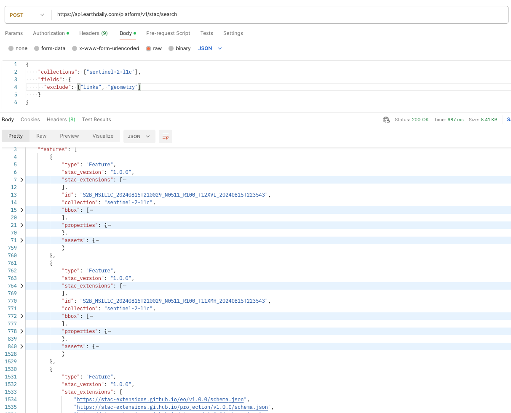
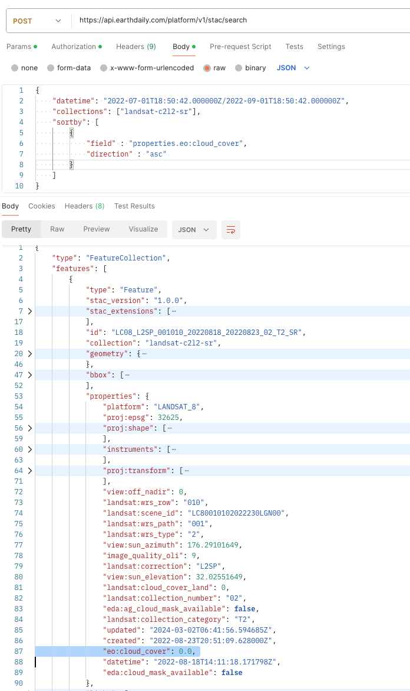
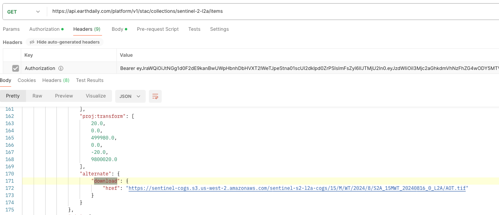
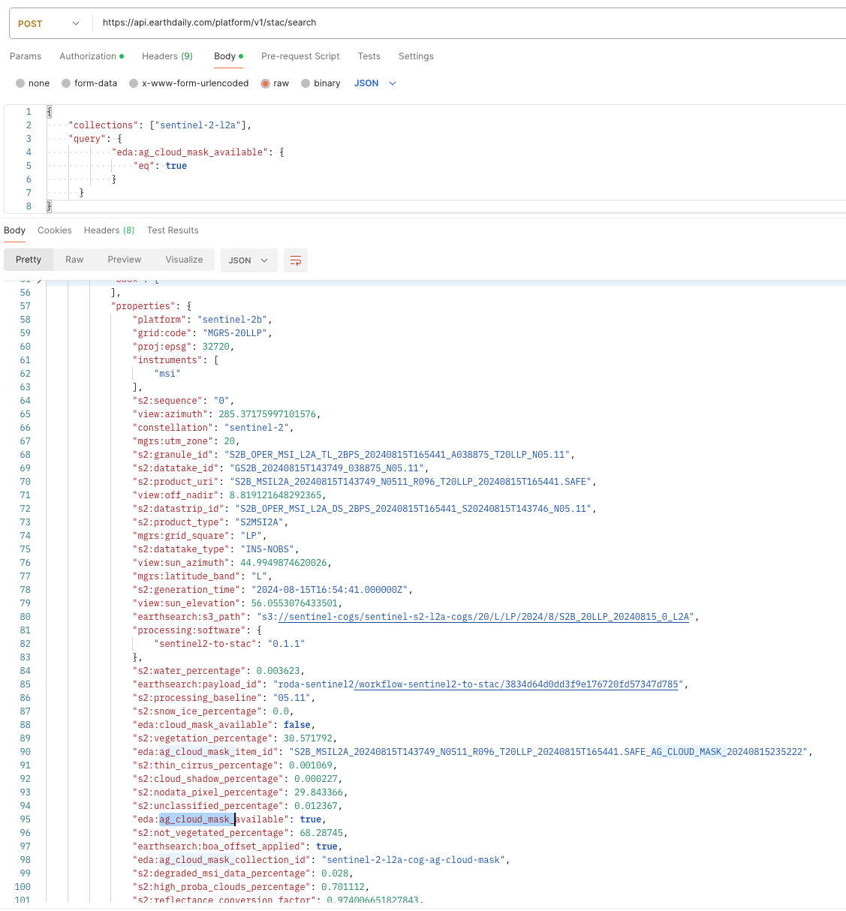

## Postman Examples
Before you try out the various endpoints, you need to set up the authentication for the Postman. [Authentication Page](../../GettingStarted/APIAuthentication#postman) describes how it is done.

## Collections 
Return list of all Collections 

## Collection

Return specific Collection 

## Items 
Return paged Items ordered by datetime descending (It doesn’t support search parameters, so often /stac/v1/search is preferred instead)

## Item 
Returns a single Item for a given Collection and Item ID

## Queryables 
Returns the queryable names for the STAC API Item Search using Query Extension
Below are the two ways to query the “queryable items“ for a given collection

## Search  

Implements STAC basic Item search functionality  + extensions 

Ensure the **content-type** header is **application/json**

### **[Query Extension](https://github.com/stac-api-extensions/query) via POST Method**

>EarthPlatform STAC API supports the [Query Extension](https://github.com/stac-api-extensions/query). It currently does not support the Filter Extension.

Advanced searching can be performed using a `query` object. This allows searching over supported properties on STAC items using various operators.

### [Fields Extension](https://github.com/stac-api-extensions/fields)
The Fields Extension allows you to specify which fields are returned from the API, reducing data transfer size. 

Exclude 

### [Sortby Extension](https://github.com/stac-api-extensions/sort)
By default, Items are returned by `datetime` descending. Then by `id` ascending.

Sorting by property `eo:cloud_cover` is also supported on the `/search` endpoint:

| Asc|Desc|
|----|---|
|  |  |

## Downloading Assets

## CloudMasks

