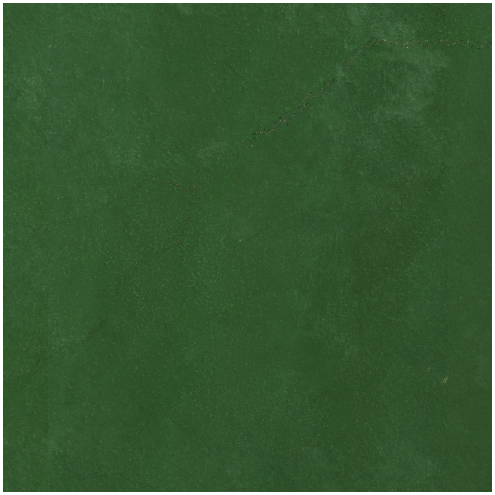
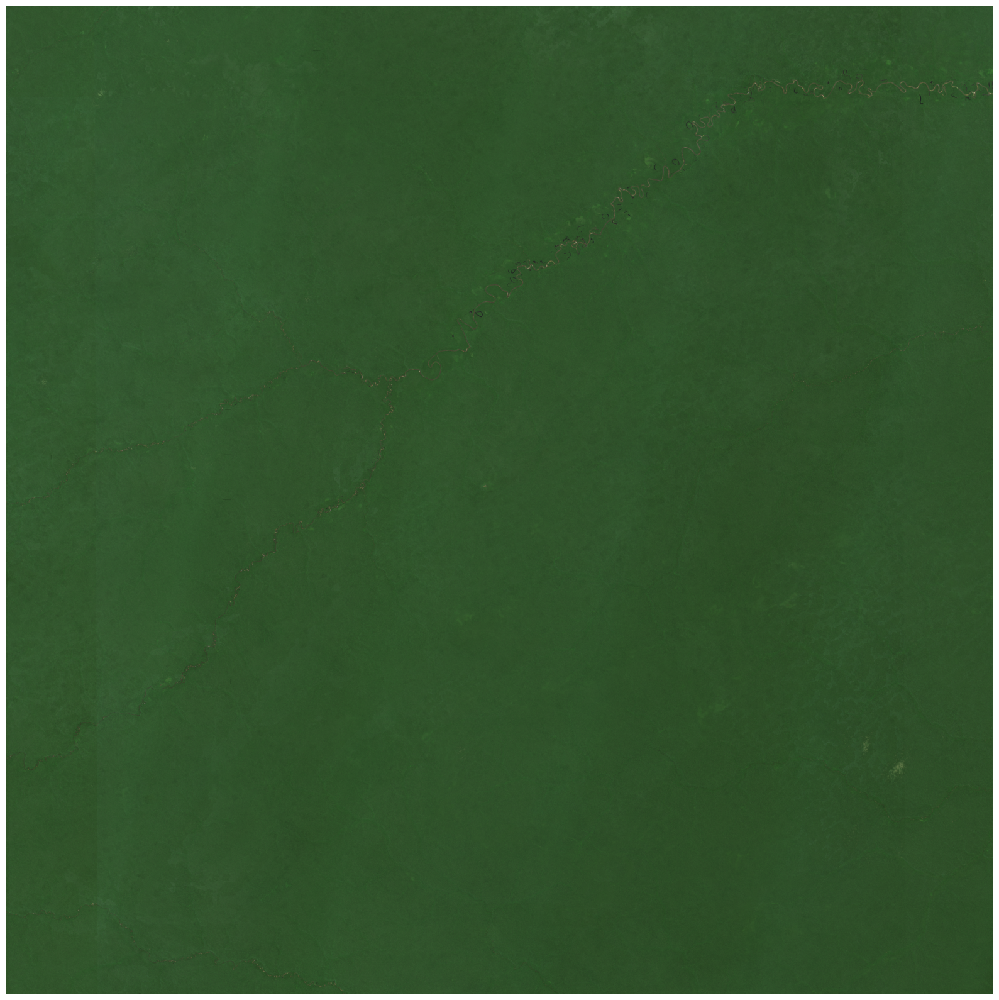

# Temporally Consistent AI-Ready Mosaics

Powering ML applications with a seamless cloud-free image 

# What Are AI-Ready Mosaics
AI-Ready mosaics leverage advanced processing 

## STAC Item Structure
[TBW]

## Methods
### Cloud Masking

[EDA's Accurate Cloud Masking](https://earthdailyagro.com/spend-less-data-scientists-time-cleaning-data-high-quality-cloud-masks-for-sentinel2-landsat-and-others-available-today/) have been shown to be more accurate then current open data standard processing which improves ML applications and the pixel compositing process for mosaics. 

The accuracy of the EarhDaily Agro cloud mask is higher than the cloud mask of other providers, allowing for a reduction in under-detection and keeping a high quality on cloud over-detection to not miss clear areas. 

|Cloud Mask Provider|Over-Detection|Under-Detection|
|:----:|:----:|:----:|
ACM|1.65%|3.85%
Fmask 4 (Matlab)|0.21%|27.18%
Fmask (Python)|1.12%|26.6%
ESA|0.97%|42.1%

EDA's Auto Clear Mask (ACM) improves the detection and the efficeny of clouds in Senintel-2, Landsat 8, and Landsat 9.

|
Mosaics Produced with ESA's Cloud Mask
 | 
Mosaics Produced with EDA's Cloud Masks
|
|:---:|:----:|
| | |

