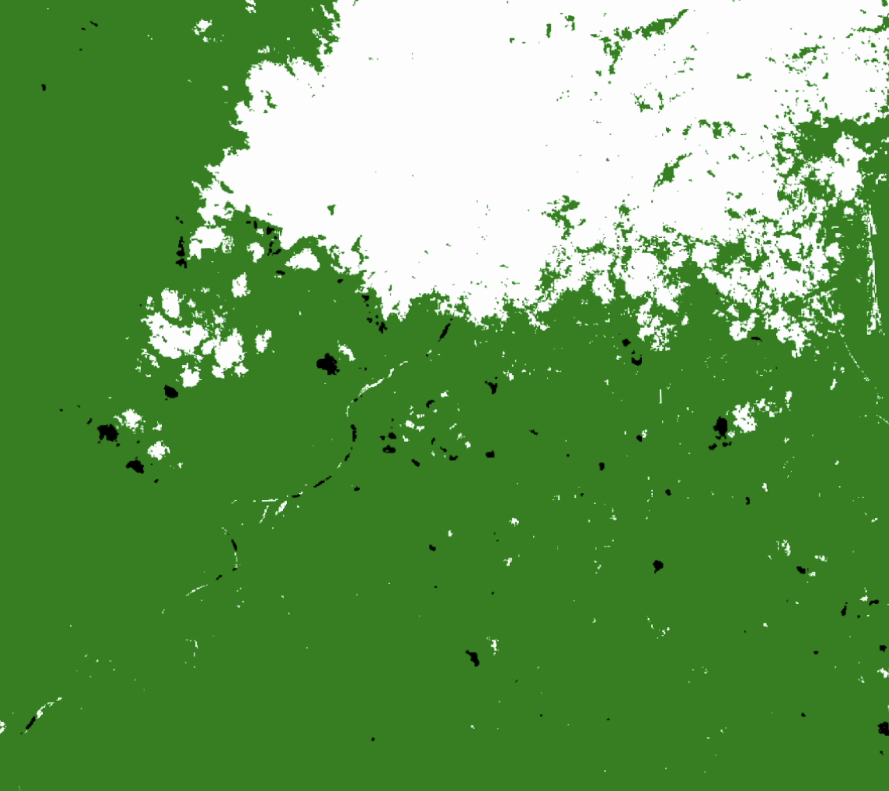
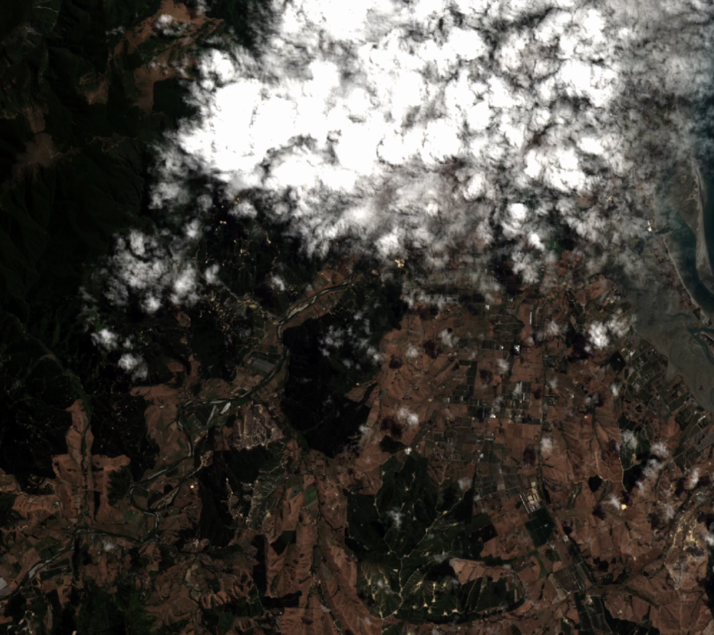
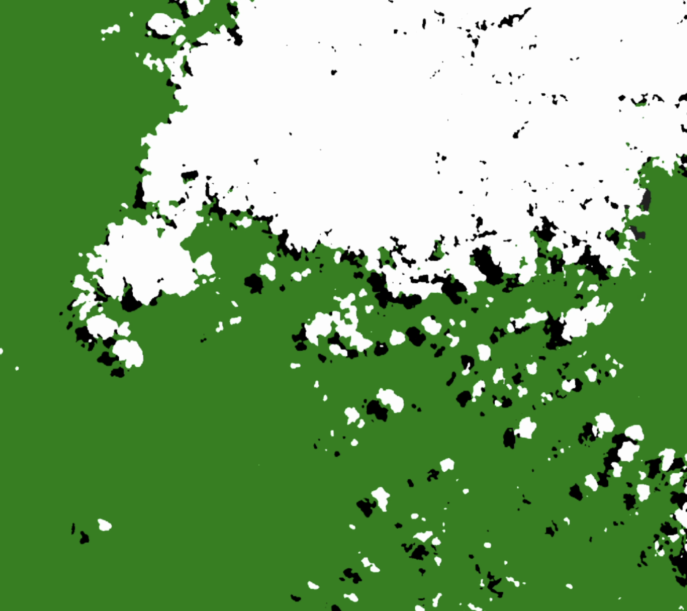
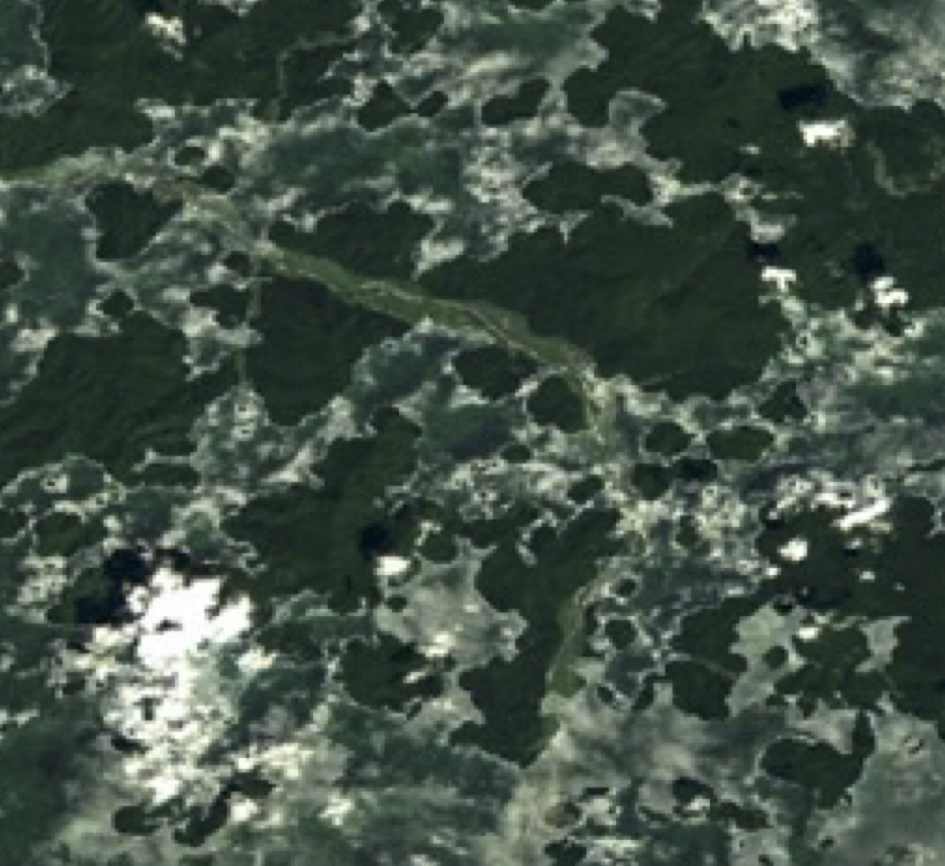
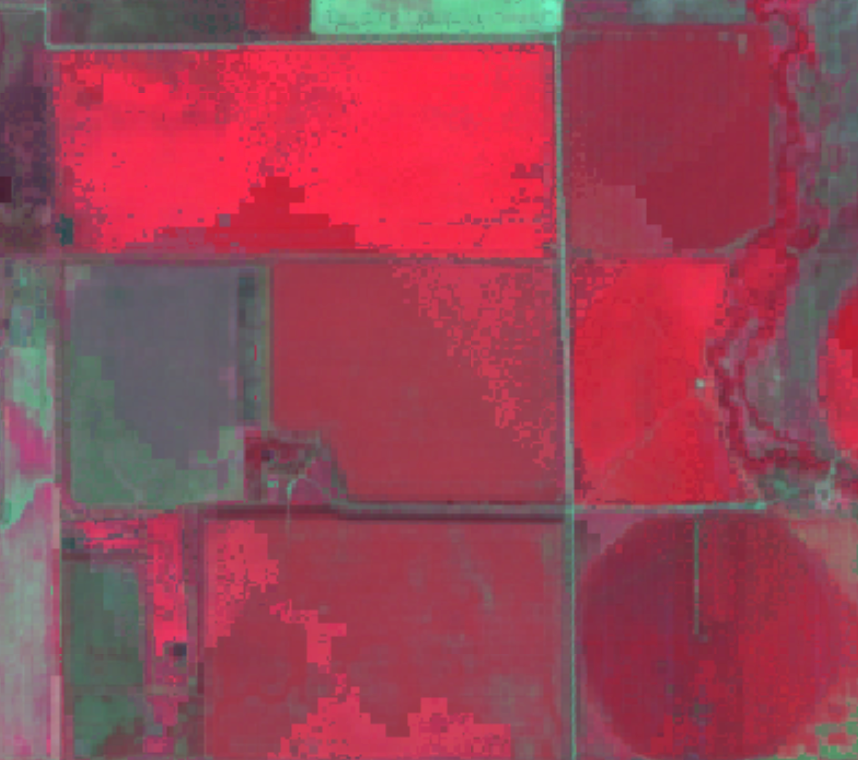

# Cloud Masking

[EDA's Accurate Cloud Masking](https://earthdailyagro.com/spend-less-data-scientists-time-cleaning-data-high-quality-cloud-masks-for-sentinel2-landsat-and-others-available-today/) have been shown to be more accurate then current open data standard processing which improves ML applications and the pixel compositing process for mosaics. 

The accuracy of the EarhDaily Agro cloud mask is higher than the cloud mask of other providers, allowing for a reduction in under-detection and keeping a high quality on cloud over-detection to not miss clear areas. 

|Cloud Mask Provider|Over-Detection|Under-Detection|
|:----:|:----:|:----:|
EDA's Cloud Masks|1.65%|3.85%
Fmask 4 (Matlab)|0.21%|27.18%
Fmask (Python)|1.12%|26.6%
ESA|0.97%|42.1%

EDA's Auto Clear Mask (ACM) improves the detection and the efficeny of clouds in Senintel-2, Landsat 8, and Landsat 9.

| Mosaics Produced with ESA's Cloud Mask | RGB Image of Cloud Area | Mosaics Produced with EDA's Cloud Masks |
|:----:|:----:|:----:|
|  |  | | 

## Why do Cloud Masks Matter?
Under-Detected Cloud Masks lead to the inclusion of pixels that are not representative of the ground measurement a mosaic is eeking to construct. This can cause various artifacts within the mosaicing process which are avoided as much as possible, except where this is data extremely limited data.  In general the larger the Time Range of Interest, the more likely getting cloud-free measurements is.

| Pixel Halo Affect from Poor Cloud Masks | Challenged Pixel Balancing Example |
|:----:|:----:|
|  |  | 
| For this example, mosaics have been produced with undetected cloud masks for mosaic construction. | For this example, mosaics have been produced to demonstrate the inconsistency made worse with inadequate cloud masks. |

## References
EDA's cloud masking technology is built off of the [CloudSEN12](https://cloudsen12.github.io/) datasources

