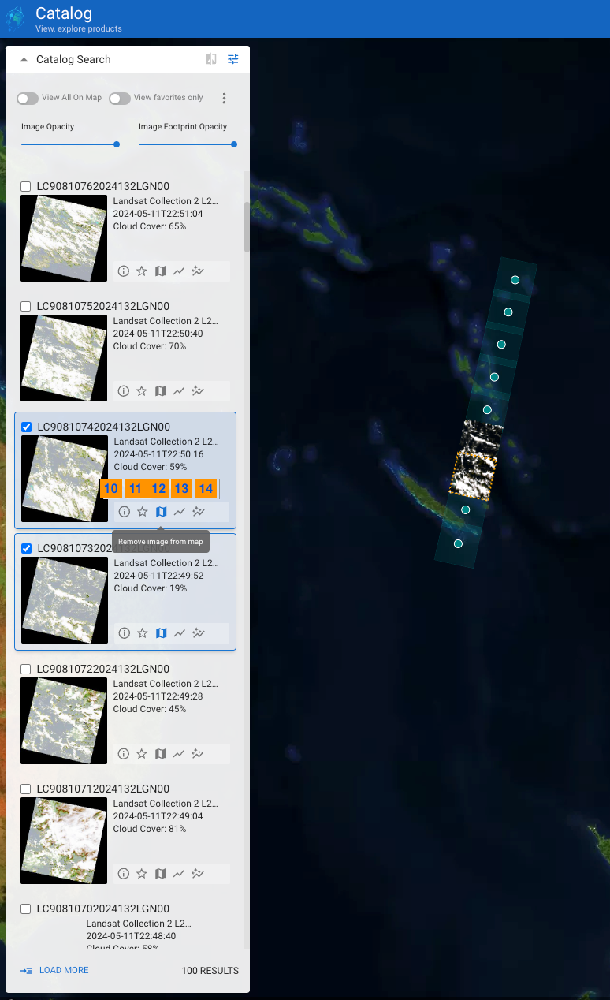
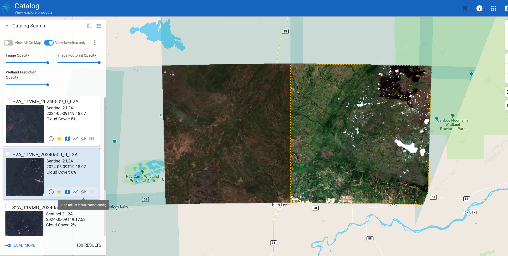

# Table of Contents
* [Introduction](#introduction)
* [Search](#search)
* [Interacting with the catalog data](#interacting-with-the-catalog)
<!--
* [Interacting with the product data](#interacting-with-the-product) 
* [Placing an order and receiving it](#placing-an-order-and-receiving-it)
-->

## Introduction
Customers can get access to our image catalog and products through EarthPlatform. It is a portal where the user can browse through our minimally processed catalog items. In addition to provide useful metadata and details about the listed images, it provides capabilities to interact with the scene content and order a high resolution product for selected catalog items. You can access the [EarthPlatform](https://console.earthdaily.com/platform) by appending the endpoint /catalog to the base URL.

## Search
EarthPlatform has search panel with various options to customize your search. Lets have a look at them.

Once you login with your credentials, the landing page for EarthPlatform is shown below

| S. No     | Label     | Description       |
|-----------|-----------|-------------------|
|  | Search box | Enter any geographic area like “Vancouver”, “Chile” etc to find and focus. |
|  | Polygon tool | It allows you to select a given area on the map quite precisely by allowing you to create a vertex as and when you do a left click. Make sure you click the first vertex of the polygon to complete it. |
|   | Rectangle Polygon | Select two vertices of the diagonal on the map to form a rectangular area. |
|  | Input GeoJSON | Click this button if you have a GeoJson you wish to enter for the given area to define it. |
|  | Layers | Select the layers you wish to see on the map. Options include satellite, streets or both. |
|  | Ruler | This one allows you to select the endpoints to draw a line and gives you the distance of each line as you keep drawing around. |
|  | Results panel | This is the area where you would see the thumbnails of the search results for your images. |
| | Filter panel | Allows you to enter various search criteria. Initially it has selection for Collections and time range. As soon as you select the collection, it expands and you can enter additional search parameters. |

NOTE : The filter panel expands with additional parameters based on the collection selected as shown below. You can also see the results panel populated with images and each thumbnail on the left that you hover over will show a center mass turned yellow on the map

Below are some images that will give you an idea of how the various tools mentioned above work

GeoJSON Viewer

Street and satellite View

 | Street View  |   Satellite View  |
 |--------------|-------------------|
 ||  |

Ruler

## Interacting with the catalog

Now lets see once you have the search results, what all can you do with those images. As you can see below, you have a small checkbox to select one or more images for any actions you would like to perform.

| S. No.    |  Label    | Description       |
|-----------|-----------|-------------------|
|   | Show/Hide Filter | This button toggles the filter panel. For this image I have hidden the filter panel as you see below. |
|   | Show Item Properties | It shows the Item Properties on the right hand side panel |
|   | Favorite Item | Tag the image as favorite. Once you tag even one image as favorite, a toggle button will appear at the top (as shown in the right side image) to show only the items tagged as favorites. |
|   | View on Map | This enables the images to be rendered to appear as tiles on the map instead of just the center mass. |
|   | View Visualization | Toggles the visualization panel where you can adjust the min and max of the available color bands and also the gamma values. You can also update the min and max based on the current image. |
|   | Auto adjust Visualization | Auto adjust the image by applying the settings in the visualization panel for bands, gamma and the min and max percentiles. If the values in visualization panel have not been set then it applies the default values. |
|   | View all on Map | This is a toggle which you should be really careful to use. It will render all the images on the map and because each rendering takes some time, doing it on a large no. of images can take some time and you might need to be patient for it to complete rendering everything. | 
|   | View Favorites Only | This toggle button will show all the images that the user has tagged as favorite (star button next to the thumbnail) |

Below is the example of the Item Properties as shown on the right

Click on the “Show Full“ to pop up a form that will show the text and JSON format of the STAC item properties as below

Display Mode : Text below. This comes really handy when you want to get the STAC details of the given image/item. You can also get the individual asset urls and download the images as shown below in the “href” 

Here is the image showing the JSON format of the item properties. This is very useful when you want to get the whole or part of JSON and use it in your own application for several purposes.

Here is the example of tagging an item as favorite and then toggle the View favorite to see only the favorites list

<table>
  <tr>
    <td>Favorite tag</td>
     <td>View Only Favourites</td>
  </tr>
  <tr>
    <td></td>
    <td></td>
  </tr>
 </table>

Next is the example of View on Map button

Here is the example of what the visualization can do when you change the min and the max band ranges

Below is the example where two images are selected and viewed on the map. Auto visualization was enabled for the right hand side image and you can see the difference it makes.

| S. No.    | Label | Description |
|-----------|-------|-------------|
|    | Fly to Bounds | When you click at the center of this button, it zooms into the map to this thumbnail for a focussed view. | 

| S. No.    | Label     | Description       |
|-----------|-----------|-------------------|
|   | Download | Download button that lets you download the catalog / product based on the tier you belong to and the collection you are allowed. Some tiers and collections cannot download the images. |
|  | Add to Cart | This option appears for the low resolution images from a catalog. You can eyeball the search images and can add the item to the cart if you wish EDA to process it as high resolution ARD product or a visual product. You can view the shopping cart by clicking the cart button on the top right. |
|  | Latency Tier | In the shopping cart, you will see all the items aded. You can choose the further options of standard vs expedited processing of your order. |
|  | Product Type | Once in the shopping cart, you also have the option to choose the derivative product you can order based on the image you have selected. In the example below, since the item in the cart is EDC catalog, you can choose to order ortho, AI and ARD products |
|  | Checkout | Checkout for placing the order successfully. You will get the confirmation and the order no. which you can further track in your account information page |

<table>
  <tr>
    <td>Download and Add To Cart</td>
     <td>Cart Options</td>
  </tr>
  <tr>
    <td></td>
    <td></td>
  </tr>
 </table>

Next, we can see how we can compare two images over a period of time to see how the landscape is changing. We can do this by using Map Slider

Below there are two images chosen over the same area but with different dates “2022/03/15“ and “2022/03/23“. They have been tagged favorite (with view favorite list enabled) and View on Map enabled to be able to see the landscape details.

| S. No.    | Label     | Description       |
|-----------|-----------|-------------------|
|   | Show/ Hide Map Slider | This is the toggle for Map Slider. It gives you a capability to slide the area from left to right. Specially useful when you have two images, one on the left and one on the right. As you slide you will be able to see the landscape changes given the images are of different dates. |
|  | Move Image Left | Click this L button to select the image to be seen on the left of the image | 
|  | Move Image Right | Click this R button to select the image to be seen on the right of the image | 
|  | Slider | The slider  |

Below are the differences over a particular area which shows the installation of the solar panels that happened within a few days (from 2022/03/15 to 2022/03/23)

Now, there are some slider options to help you see the relative difference or similarity between the image and the base-map.

| S. No.    | Label     | Description       |
|-----------|-----------|-------------------|
|   | Image Opacity | Image Opacity is used if you want to check location or any other attribute relative to the basemap. |
|   | Image Footprint Opacity | As a query result, the more footprints you have the darker the footprints get until you can't see the ground. So Image Footprint Opacity helps to make the image footprint transparent and then you can find your location. |
|  | Wetland Prediction Opacity | This is useful when you have a landcover raster rendered for wetland prediction. Once you have rendered the landcover classification, you can use this transparency level to compare with the image background and avoid rendering every time. |
|  | Wetland Prediction | It renders render the landcover classification for the image. It shows dark green for forest, yellow for crops, cyan for wetland and blue for water. One thing to note is that you need to have the Image Opacity at 0% for the wetland classification to be visible. |

Below you can see the opacity for the image at 100%, 50% and 0

<table>
  <tr>
    <td>Image Opacity - 100%</td>
    <td>Image Opacity - 50%</td>
    <td>Image Opacity - 0%</td>
  </tr>
  <tr>
    <td></td>
    <td></td>
    <td></td>
  </tr>
 </table>

Here is an example of the Footprint opacity

<table>
  <tr>
    <td>Footprint Opacity - High</td>
    <td>Footprint Opacity - Low</td>
  </tr>
  <tr>
    <td></td>
    <td></td>
  </tr>
 </table>

Now, lets see when wetland prediction is enabled for images, how does the opacity slider work. Examples at 100% and 20%

<table>
  <tr>
    <td>Wetland Opacity - High</td>
    <td>Wetland Opacity - Low</td>
  </tr>
  <tr>
    <td></td>
    <td></td>
  </tr>
 </table>

That completes the list of our extensive operations that can be done with the Catalog images.

<!-- 
## Interacting with the product
## Placing an order and receiving it
-->