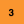
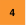
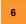
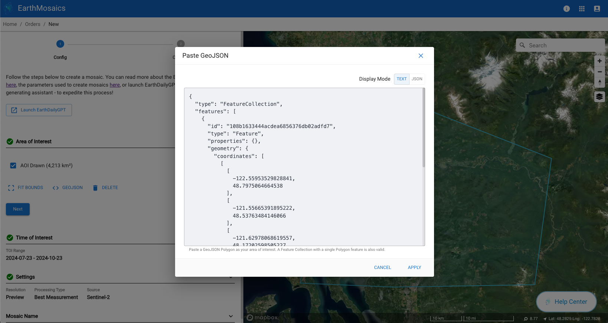
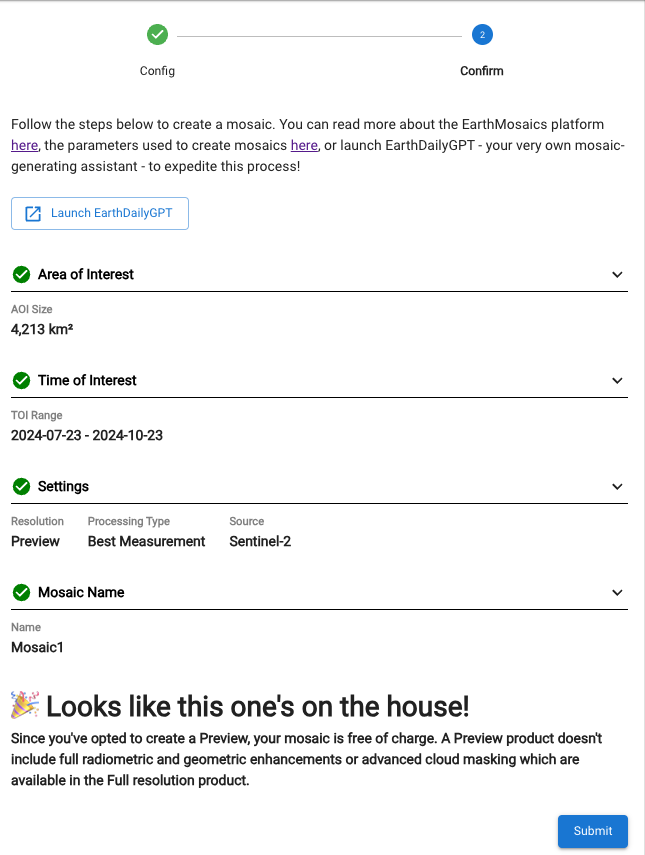
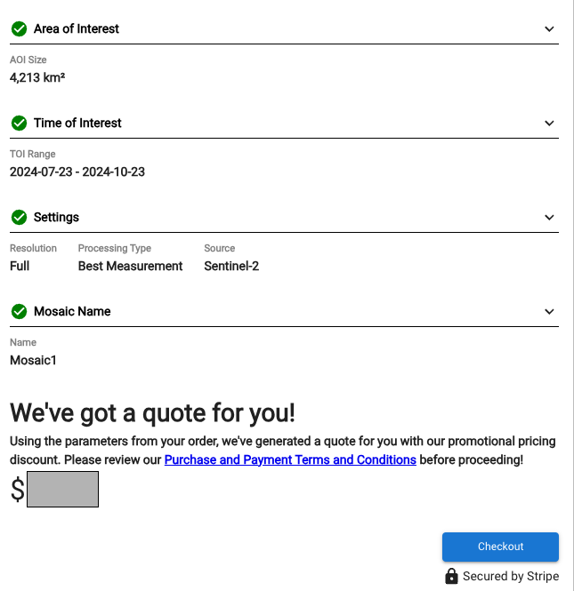
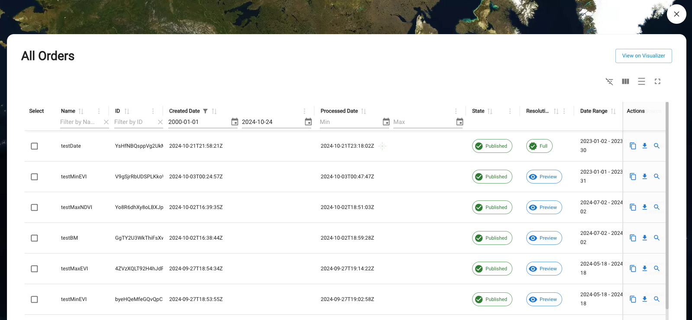
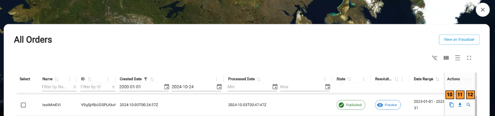
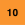

# Table of Contents
* [Introduction](#introduction)
* [Getting started with Mosaics](#getting-started-with-mosaics)
* [Mosaic Preview Order](#mosaic-preview-order)
* [Mosaic Full resolution Order](#mosaic-full-resolution-order)
* [Managing Mosaics Order](#managing-mosaics-orders)

## Introduction
[**EarthMosaics**](https://console.earthdaily.com/mosaics) delivers cloud-free, temporally coherent mosaics with ​the highest possible geolocation, radiometric ​quality, enabling users to examine true signals, minimize false positives in change detection, and easily contextualize with other geospatial datasets. From analysing a regional forest to monitoring a mining site, predicting water reservoir levels to measuring melting permafrost, EarthMosaics (now in beta) offers application-specific and customized insights fulfilling unique needs of each use case.

AI Ready Mosaics are complex, costly to produce, and designed to feed directly into ML applications​.

[EarthMosaics](https://console.earthdaily.com/mosaics)  from EarthDaily Analytics provides you a way to explore and get a free preview and you can also place orders for full resolution Mosaics. 

## Getting started with Mosaics

Below is the landing page you see when you navigate to [EarthMosaics](https://console.earthdaily.com/mosaics)

When you are the first time user, you get the Welcome dialog with an option to GetStarted.

Pressing the `GetStarted` will take you to a NewOrders page. Let's see what are all the options we have while placing the order:

| S. No     | Label     | Description       |
|-----------|-----------|-------------------|
|   | Launch EarthDailyGPT | You can use EarthDailyGPT to assist you with generating a mosaic   |
|   | Area of Interest - draw on the map | You can start drawing a polygon for your mosaics order. The limit currently is < 200,000 km2   |
|  | Area of Interest - use GeoJSON | Instead of drawing a polygon, if you have an existing GeoJSON, you have an option to enter it here. The restriction of < 200,000 km2 applies to this too |
| | Time of Interest | Specify the time of interest for your Mosaics order |
|  | Settings | This one gives you multiple choices to place your order as per your needs|
|  | Mosaic Name | Enter a name for your Mosaic order for easy identification|

The area of interest (AOI) defines the geographic extent used to build the mosaic. You can either draw the AOI on the map or provide the AOI's GeoJSON below. To draw, start by choosing either the Rectangle option or the Polygon option, and then left-click on the map. After adjusting the extent of your AOI, complete the AOI by left-clicking. Once drawn, you can select your AOI to reshape its boundaries.

Once you draw a polygon, you will see the area calculator diaplays the total area selected by you. You will see three options appear 

| S. No     | Label     | Description       |
|-----------|-----------|-------------------|
|  | Fit Bounds | This option allows you to bring back the focus on the area drawn and fits it to the viewport    |
|  | GeoJSON | Instead of drawing a polygon, if you have an existing GeoJSON, you have an option to enter it here. The restriction of < 200,000 km2 applies to this too |
|  | Delete | Delete the existing AoI |

## Mosaic Preview Order
The settings define how your mosaic will be generated. 
* Resolution determines the quality of your mosaic: Preview is free, whereas Full is paid. You are advised to first create a Preview Resolution mosaic, with your desired settings, to preview your order. 
* Processing type determines the pixel selection process: 
    * Best Measurement: an algorithm that takes into account cloud, cloud shadow, distance to nearest occlusion, aerosol optical thickness, relative acquisition time, acquisition platform, and smoothness characteristics to select the most representative value for each individual pixel in the mosaic
    * Min/Max NDVI (beta): augments the Best Measurement algorithm by including an additional weighting based on the per-pixel NDVI value, reducing artefacts in the imagery while still generating a representative maximum or minimum NDVI
    * Min/Max NBR (beta): augments the Best Measurement algorithm by including an additional weighting based on the per-pixel NBR value, reducing artefacts in the imagery while still generating a representative maximum or minimum NBR

* Source specifies if your mosaic will be made using only Sentinel-2A or the combination of Sentinel-2A and Landsat-8/9.

Now, after you confirm all settings and enter a name, submit the order

## Mosaic Full resolution Order

Mosaics Full Resolution Order is very similar to the preview except that it has an additional step for payment.

As you will notice in the above images, the Preview order has mainly 2 steps
* Configuration
* Confirmation

Now, the Full Resolution Mosaic has an additional step 
* Quote

To place the Full resolution Mosaics order you will primarily use "Full" as your Resolution setting as shown below

Please confirm the order settings in order to checkout

The checkout screen below shows you the order price. If you are ready to pay, go ahead and chekout to get to the payment page below.

If you have any coupons to redeem, you can enter the coupon code in order to get the eligible discount. Once you are ok with total amount and have entered relevant payment details, please proceed to pay

## Managing Mosaics Orders

Once you have placed the Mosaic order (either Preview or Full), you will be redirected to your Dashboard where you can see all your orders.

Upon submission, you will see that your order is in Processing state. There is a button on top right of the panel if you want to View all of your Mosaic Orders

The orderId you see in this page can be found as a LineItemId in your Account Information page under "MyOrders"

Once the order is processed successfully, you will see the state changed to "Processed" and some other options enabled for the order

| S.No        | Label     | Description       |
|--------------|-----------|-------------------|
|  | Copy | This option allows you to copy the order in case you want to use the same settings or have a minor modification to place another order     |
|  | Download | This is where you can download your product - Preview or Full |
|  | View | This option allows you to view the product in the Visualizer  |

Below is the Visualizer that opens up when you click on the View button on the Orders page. This visualizer is very similar to our EarthPlatform UI and has many common components needed to interact with the Mosaic product similar to our other products

That is it !! Happy Mosaicking !! 
