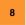
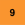
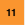

# Table of Contents
* [Introduction](#introduction)
* [General Information](#general-information)
* [My Account](#my-account)
* [My Orders](#my-orders)
* [Order State](#order-state)

## Introduction
The Account Information page is the landing page for each user of the customer account when they login to the [Account Information](https://console.earthdaily.com/account) It allows the user to check his own account details, his orders etc. It also has the link to the other applications like Catalog UI, Mosaic etc

## General Information
  
On the upper right hand side of the window, you will see three small icons as below

|   Icon    |   Description     |
|------------|------------------|
|  | About page that shows the EarthDaily version |
|  | It will show you a list of hosted applications from EarthDaily and you can use it to switch between different applications |
|  | Quick information about the signedin user along with his/her account and an option to sign out |

  

## My Account
| S. No | Label | Description |
|-------|-------|-------------|
|   | User   |  Logged in user details |
|   | Account | Details of the account that the user belongs to. |
|    | API Credentials |  Token URL to generate “Bearer Token” for API authentication. |
|   | Hosted Apps     | Use this to switch between various apps available. |

  

## My Orders

It lists all the orders being placed under the customer account you belong to. The purpose of showing all the orders apart from the one you placed is mainly for optimization, to ensure that you don’t end up placing a duplicate order.

|  S.No &nbsp     | Label | Description |
|---------|-------|-------------|
|   | My Orders | To go to your orders page. |
|   | Search by Id | If you know your Orders Id, you can use this to search your order. |
|  | Order Details dropdown | This dropdown shows all the details related to your order. Once order is placed, you will see it in “Processing” state. When the order is completed, it will show “Processed“ and you will also have the Processed date and time for that oder. The Product UUID will also show up after order is processed. This can be helpful to use for searching your product in destination bucket or troubleshooting.
|  | Search | This is a free form text search similar to browser search for anything in the results. Instead of searching on the current page (like browser search), this is quite helpful when you want to do free form search on the whole result. It also filters the result records based on the match.|
|  | Download | It allows you to download the search results as a csv if you want to to further analyze and do advanced queries. It only extracts the first level order records and leaves out the dropdown order details. |
|   | Print | Allows you to print the search results. |
|   | View Columns | Allows you to select the columns you want to view for the search results |
|  | Filter | This is the detailed filter for every attribute of the order and allows you to select from the values in all the orders. |
|  | Refresh | Refreshes the page as per current criteria. |

   

  

## Order state

When you place an order, it can go through varous states. Below is a table defining various states and what they mean.

|   Order State         |              Description              |
|-----------------------|-----------------------------------------------------------------------------------------------| 
|   PENDING             |   Order submitted but pending payment and/or approval (eg. mosaic)       |
|   CANCELLED             |   Order cancelled before proceeding (eg. payment failed, etc). Will only be used for orders which could have the “pending” state for now       |
|   IN_PROGRESS             |   Order submitted and under processing       |
|   COMPLETED             |   Order completed with product(s) published to skyfox and ready to use       |
|   PRODUCTION_ERROR             |   Processing failed somewhere along the pipeline, or incase of multiple prodicuts, one or more products were not published successfully to skyfox       |
