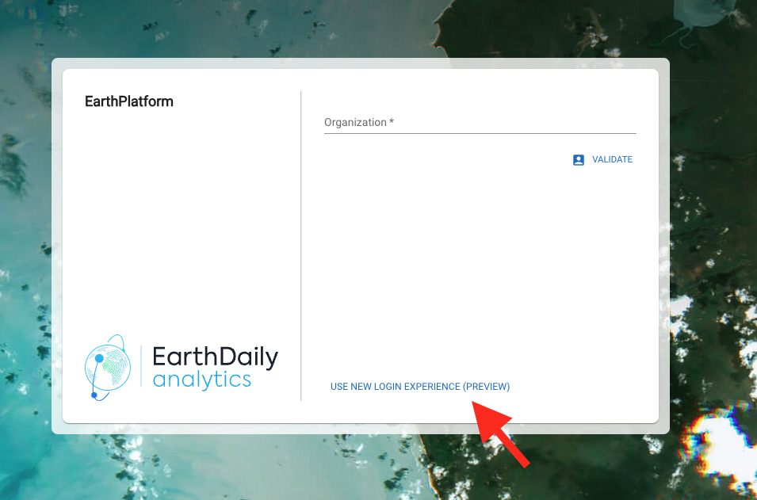
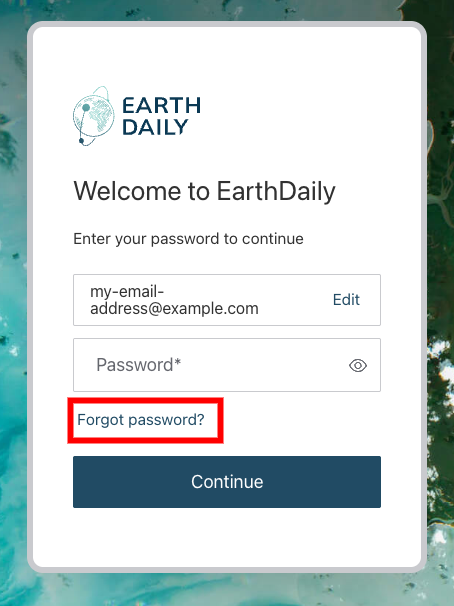
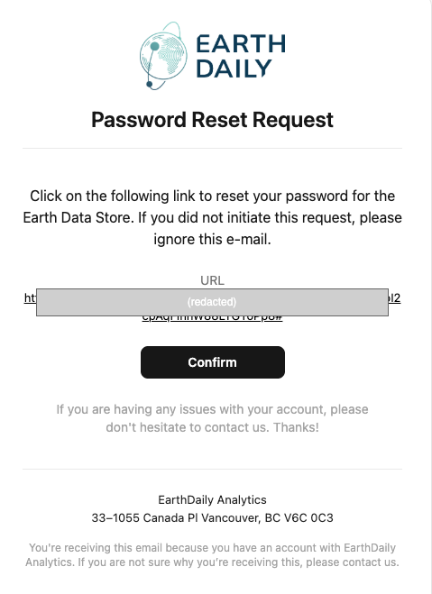

# Preview to the New Login System

EarthDaily is introducing an enhanced authentication system for all EarthDaily Console sites. This upgrade represents an improvement in our security infrastructure and lays the foundation for advanced security features in the future. The new authentication system is available now as a preview feature, and while we plan to make it the default in early 2025, we're providing a transition period during which both authentication methods will remain accessible.

## How to access the new login experience

To access the new login system, **leave the `Organization` field empty** on the login page (we will keep track of this for you). Instead, immediately look for the **Use New Login Experience (preview)** link in the bottom of the login box.

Clicking the link will take you to the new login flow, where you should see the following prompt:

### Verifying that you're using the new flow

You will be redirected to a page under a URL that starts with `login.earthdaily.com`. For your security, always verify that you're entering credentials into a page that's hosted on this domain. EarthDaily will never request your password through any other domain.

### Setting Up Your Password

To ensure maximum security, all users must reset their passwords to access the new system. You can reuse your current password if it meets the new security requirements. Note that passwords for the new and old systems are maintained separately, and changes to one system's password won't affect the other.

During the preview period, please initiate the password reset process by clicking the **Forgot Password?** link after entering your email address:

You'll receive a password reset link via email that should look similar to the following screenshot. The link would be valid for 5 days, although you can always request a new link by clicking on **Forgot Password?** again. For your safety, always ensure the link in the email goes to an URL under `https://login.earthdaily.com`:

After setting your password, you can return to the console to log in with your new credentials. Remember to always click on the **Use New Login Experience (preview)** link to be taken to the new login pages.

## Enhanced API Authentication

The new system introduces improved API authentication with a simplified single API token system. Users now have the ability to revoke compromised tokens and generate new ones as needed. When provisioning a new API token, you may be asked to log in again if required for security purposes.

**Upon token generation, you'll be shown your API token exactly once.** Please save it immediately in a password manager or secure vault, as we cannot display it again. If you lose your token, you'll need to delete the old one before you can generate a new one.

### Using the new API token

Your new API token can be used with existing scripts and tools that use the **OAuth Client Credentials Flow** as described in the [Authentication Page](../../../GettingStarted/APIAuthentication). Simply use these values in place of your old credential information:

- **EDS_AUTH_URL** or **Access token URL**: `https://api.earthdaily.com/account_management/v1/authentication/api_tokens/exchange`
- **EDS_CLIENT_ID** or **Client ID**: `EARTHDAILY_API_TOKEN`
- **EDS_SECRET** or **Client Secret**: (Use your new API Token here)

{: .highlight} 
 Legacy API credentials will be deprecated when the old authentication system is retired. We strongly recommend testing and transitioning to the new API token system as soon as possible to ensure uninterrupted service.

## Need Help?

Our support team is available to assist you with the transition to the new authentication system. Please don't hesitate to reach out if you have any questions or encounter any issues during the process.
