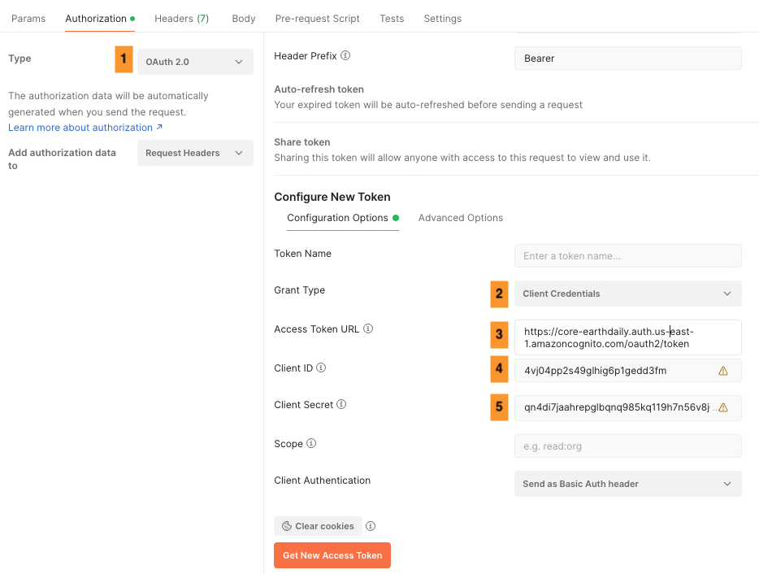

# Table of contents
* [Authentication](#authentication)
* [Examples](#examples)
    * [Command Line](#command-line)
    * [Python](#python)
    * [Postman](#postman)

</br>

## Authentication


EarthPlatform STAC API is protected by bearer authentication.
A bearer token must be generated using [OAuth Client Credentials Flow](https://www.oauth.com/oauth2-servers/access-tokens/client-credentials/). The required client_id, client_secret and access_token_url values can be found on [Account Management](https://console.earthdaily.com/account) page. These API credentials are specific to your user account on EarthPlatform and should be kept confidential.


### Point to Note

* The generated access_token will have a 1 hour expiry. 
* The access token should be cached locally and included in each STAC API request as a bearer authorization header.  
* When the access token has expired, an error 401 (Unauthorized) will be returned from STAC API requests. 

</br>

## Examples

## Command Line
Example curl request to generate token

```
curl --location '<ACCESS_TOKEN_URL HERE>'  
--header 'Content-Type: application/x-www-form-urlencoded' \
--data-urlencode 'client_id=<CLIENT_ID HERE>' \ 
--data-urlencode 'client_secret=<CLIENT SECRET HERE>' \
--data-urlencode 'grant_type=client_credentials'
```

Example curl response

```
{"access_token":"eyJraWQiO.......","expires_in":3600,"token_type":"Bearer"}
```
</br>

## Python

```
{
import json
import os
import requests

def _get_token(config=None):
    """Get token for interacting with the Earth Data Store API.

    By default, Earth Data Store will look for environment variables called
    EDS_AUTH_URL, EDS_SECRET and EDS_CLIENT_ID.

    Parameters
    ----------
    config : str | dict, optional
        A JSON string or a dictionary with the credentials for the Earth Data Store.
    presign_urls : bool, optional
        Use presigned URLs, by default True

    Returns
    -------
    token : str
    
    """
    if config is None:
        config = os.getenv
    auth_url = config("EDS_AUTH_URL")
    secret = config("EDS_SECRET")
    client_id = config("EDS_CLIENT_ID")
    
    if auth_url is None or secret is None or client_id is None:
        raise AttributeError(
            "You need to have env : EDS_AUTH_URL, EDS_SECRET and EDS_CLIENT_ID"
        )

    token_response = requests.post(
        auth_url,
        data={"grant_type": "client_credentials"},
        allow_redirects=False,
        auth=(client_id, secret),
    )
    token_response.raise_for_status()
    return json.loads(token_response.text)["access_token"]

print(_get_token())
}
```
</br>

## Postman

Below is the screenshot showing the **Authorization tab** in Postman and follow the steps 

1. Select the Type as <span style = "color: blue">OAuth 2.0</span>
2. Select the Grant Type as <span style = "color: blue">Client Credentials</span>
3. Enter the access token URL from the account information page above :point_up_2:
4. Enter the Client ID from the account information page above :point_up_2:
5. Enter the Client Secret from the account information page above :point_up_2:

</br>
</br>


