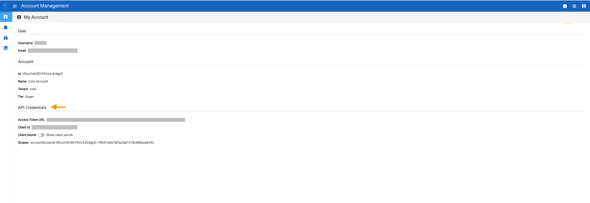
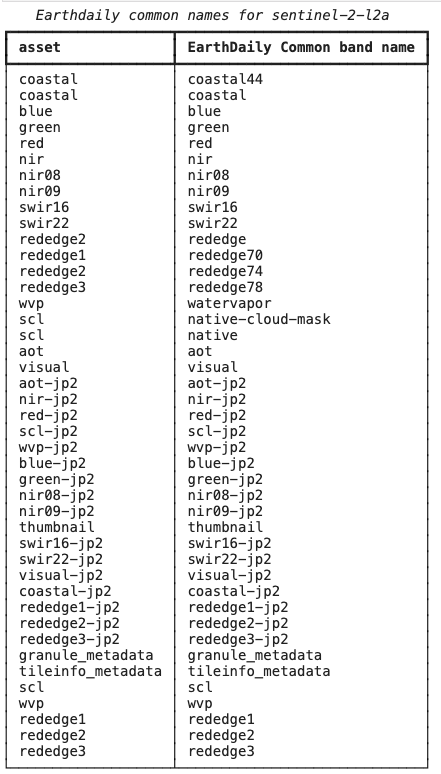

# Table of contents
* [Authentication](#authentication)
* [EarthDaily Python Client](#earthdaily-python-client)
* [Other Examples](#other-examples)

## Authentication

The required client_id, client_secret and access_token_url values can be found on [Account Management](https://console.earthdaily.com/account) page. These API credentials are specific to your user account on EarthPlatform and should be kept confidential.


For more see: [Authentication](../GettingStarted/APIAuthentication.md)

## EarthDaily Python Client

The fastest way to get up and running is to use EDA's [Python Client Repository](https://github.com/earthdaily/earthdaily-python-client). 

Build a new Conda Environment:
```
# Clone the repository and go inside
git clone git@github.com:earthdaily/earthdaily-python-client.git
cd earthdaily-python-client

# Create a virtual environment named earthdaily and install package dependencies
conda env create -n earthdaily -f requirements.yml
conda activate earthdaily

# Install package in editable mode
pip install -e .

copy-earthdaily-credentials-template --default

```


Test the Available Collections:
```
"""
from earthdaily.earthdatastore.cube_utils import asset_mapper
from rich.table import Table
from rich.console import Console

console = Console(force_interactive=True)

for collection, assets in asset_mapper._asset_mapper_config.items():
    table = Table(
        "asset",
        "EarthDaily Common band name",
        title=f"Earthdaily common names for {collection}",
    )
    for common_name, asset in assets[0].items():
        table.add_row(asset, common_name)
    console.print(table)
```

This will output a list of assets for all available collections to you in the platform.



## Other Examples


1. [Common Band Names](https://github.com/earthdaily/earthdaily-python-client/blob/main/examples/common_band_names.py)
2. [Compare Scale with Sentinel-2](https://github.com/earthdaily/earthdaily-python-client/blob/main/examples/compare_scale_s2.py)
3. [EarthDaily Simulated Datasets](https://github.com/earthdaily/earthdaily-python-client/blob/main/examples/earthdaily_simulated_dataset.py)
4. [Field Evolution](https://github.com/earthdaily/earthdaily-python-client/blob/main/examples/field_evolution.py)
5. [Create a Data Cube](https://github.com/earthdaily/earthdaily-python-client/blob/main/examples/first_steps_create_datacube.py)
6. [Create a Multisensor Cube](https://github.com/earthdaily/earthdaily-python-client/blob/main/examples/multisensors_cube.py)
7. [Stack Summary](https://github.com/earthdaily/earthdaily-python-client/blob/main/examples/summary_stack.py)

The fastest way to get up and running is to use EDA's [Python Client Repository](https://github.com/earthdaily/earthdaily-python-client). 
