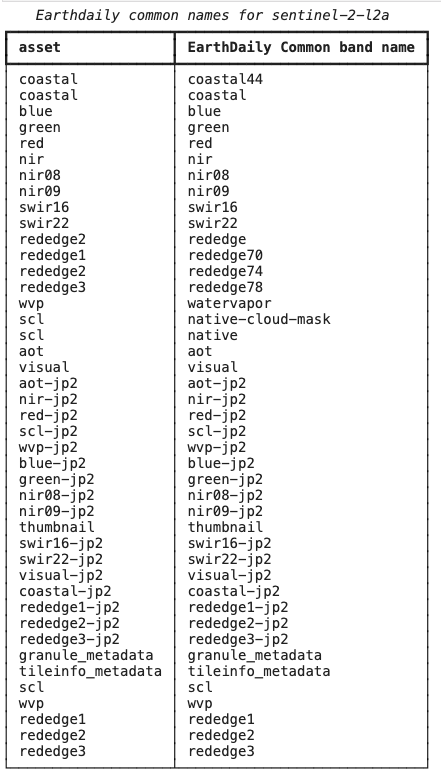

# Table of contents
* [EarthDaily Data](#earthdaily-data)
* [Authentication](#authentication)
* [API](#api)
* [Pystac](#pystac)
* [EarthDaily Python Client](#earthdaily-python-client)
    * [Other Examples](#other-examples)

## EarthDaily Data

EarthDaily data comprises of Open collections, EDA specific collections, Mosaics and Cloudmasks. There are different ways to access this data and they are outlined below. Please note that for all of the below options, you will need to have authentication details available. You can find the details about all the available [Collections](../Collections/AvailableCollections.md), [Mosaics](../Collections/EDAMosaics.md) and [CloudMasks](../Collections/EDACloudMasks.md).

1. API
2. PySTAC library
3. EarthDaily Python Client

## Authentication

There are different ways outlined below for accessing the EarthDaily data. . The required client_id, client_secret and access_token_url values can be found on [Account Management](https://console.earthdaily.com/account) page. These API credentials are specific to your user account on EarthPlatform and should be kept confidential.


For more see: [Authentication](../GettingStarted/APIAuthentication.md)

## API

Earthdaily provides STAC compliant restful APIs with various endpoints for you to access the data. You can also search the data with specific filters on fields and customize the output to include the data you are interested in. Find the detailed list of endpoints along with the examples. 

[API list](../API/APIUsage/Endpoints.md) gives you the detailed list of available endpoints

[Postman Examples](../API/APIUsage/Postman.md) are available to se the example query and the response using Postman

[Curl Examples](../API/APIUsage/CommandLine.md) are available in case you are interested to play around with our APIs using commandline 

## PySTAC

PySTAC is a library for working with [SpatioTemporal Asset Catalogs (STAC)](https://stacspec.org/en). Please find all the features and capabilities of [PySTAC](https://pystac.readthedocs.io/en/stable/) along with the details of all the set up required.

Here is a small snippet to give you an idea

```python
import os
import requests

from dotenv import load_dotenv
from pystac.client import Client

load_dotenv()  # take environment variables from .env

CLIENT_ID = os.getenv("EDS_CLIENT_ID")
CLIENT_SECRET = os.getenv("EDS_SECRET")
EDS_AUTH_URL = os.getenv("EDS_AUTH_URL")
API_URL = os.getenv("EDS_API_URL")
STAC_API_URL = f"{API_URL}/platform/v1/stac"

session = requests.Session()
session.auth = (CLIENT_ID, CLIENT_SECRET)


def get_new_token(session):
    """Obtain a new authentication token using client credentials."""
    token_req_payload = {"grant_type": "client_credentials"}
    try:
        token_response = session.post(EDS_AUTH_URL, data=token_req_payload)
        token_response.raise_for_status()
        tokens = token_response.json()
        return tokens["access_token"]
    except requests.exceptions.RequestException as e:
        print(f"Failed to obtain token: {e}")

token = get_new_token(session)

# Configure pystac client
client = Client.open(STAC_API_URL, headers={"Authorization": f"bearer {token}"})

# Get collections
for collection in client.get_all_collections():
    print(collection)
```

You can find the detailed examples using [Python script](../API/APIUsage/Python.md)

## EarthDaily Python Client

The fastest way to get up and running is to use EDA's [Python Client Repository](https://github.com/earthdaily/earthdaily-python-client). 

Build a new Virtual Environment:
```bash
# Create a virtual environment
python -m venv .venv
source .venv/bin/activate  # On Windows: .venv\Scripts\activate

# Install the EarthDaily Python client
pip install earthdaily
```

Create a `.env` file in your project directory with your API credentials:
```
EDS_AUTH_URL=https://api.earthdaily.com/account_management/v1/authentication/api_tokens/exchange
EDS_CLIENT_ID=EARTHDAILY_API_TOKEN
EDS_SECRET=<API_TOKEN>
EDS_API_URL=https://api.earthdaily.com
```

**Important:** Replace `<API_TOKEN>` with your actual API secret from the [Account Management](https://console.earthdaily.com/account) page.


Test the Available Collections:
```python
from earthdaily.legacy.earthdatastore.cube_utils import asset_mapper
from rich.table import Table
from rich.console import Console

console = Console(force_interactive=True)

for collection, assets in asset_mapper._asset_mapper_config.items():
    table = Table(
        "asset",
        "EarthDaily Common band name",
        title=f"Earthdaily common names for {collection}",
    )
    for common_name, asset in assets[0].items():
        table.add_row(asset, common_name)
    console.print(table)
```

This will output a list of assets for all available collections to you in the platform.



## Other Examples

### Examples

Find comprehensive example scripts in the [examples directory](https://github.com/earthdaily/earthdaily-python-client/tree/main/examples) of the EarthDaily Python Client repository:

1. [Asset Download Example](https://github.com/earthdaily/earthdaily-python-client/blob/main/examples/asset_download_example.py)
2. [Bulk Search Example](https://github.com/earthdaily/earthdaily-python-client/blob/main/examples/bulk_search_example.py)
3. [Datacube Example](https://github.com/earthdaily/earthdaily-python-client/blob/main/examples/datacube_example.py)
4. [Quick Start](https://github.com/earthdaily/earthdaily-python-client/blob/main/examples/quick_start.py)

### Legacy Examples

The following examples are still available but are now located in the legacy examples directory:

1. [Common Band Names](https://github.com/earthdaily/earthdaily-python-client/blob/main/examples/legacy_examples/common_band_names.py)
2. [Compare Scale with Sentinel-2](https://github.com/earthdaily/earthdaily-python-client/blob/main/examples/legacy_examples/compare_scale_s2.py)
4. [Field Evolution](https://github.com/earthdaily/earthdaily-python-client/blob/main/examples/legacy_examples/field_evolution.py)
5. [Create a Data Cube](https://github.com/earthdaily/earthdaily-python-client/blob/main/examples/legacy_examples/first_steps_create_datacube.py)
6. [Create a Multisensor Cube](https://github.com/earthdaily/earthdaily-python-client/blob/main/examples/legacy_examples/multisensors_cube.py)
7. [Stack Summary](https://github.com/earthdaily/earthdaily-python-client/blob/main/examples/legacy_examples/summary_stack.py)
