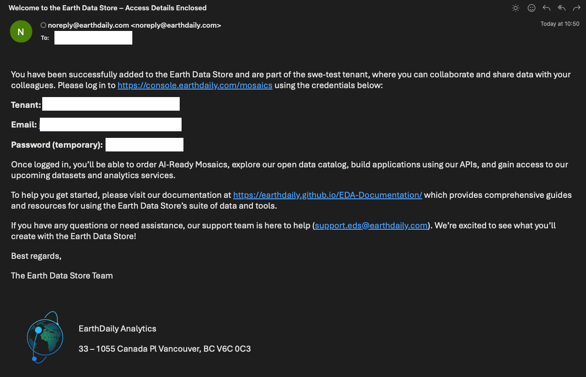

# Welcome Email

The EarthPlatform [EarthPlatform](https://console.earthdaily.com/platform/signin) is a GUI for the STAC API and also provides visualization of STAC assets along with search and many other features whereby you can interact with the images. EarthPlatform also provides a STAC compliant API for querying and downloading geospatial data.

To get started, login to [Account Management](https://console.earthdaily.com/account/signin) using your EarthPlatform credentials. These would have been provided in an email when your user account was created and it looks like this: 

 

You will need to change your password at the first login.
